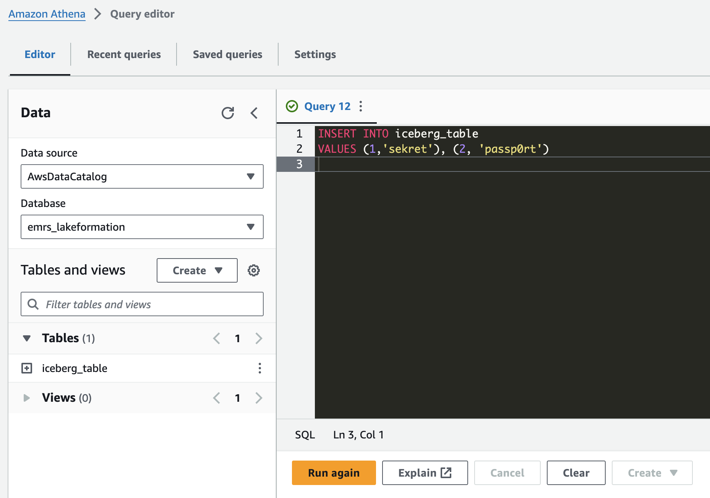

# EMR Serverless with Lake Formation for fine-grained access control

As of Amazon EMR 6.15.0, you can now use [AWS Lake Formation with EMR Serverless](https://docs.aws.amazon.com/emr/latest/EMR-Serverless-UserGuide/emr-serverless-lf-enable.html) to apply fine-grained access controls on Data Catalog tables backed by S3.

In addition, open table formats like Apache Iceberg are also supported.

In this example, we provide a CloudFormation template that creates the following resources:
- An EMR Serverless 6.15.0 application with Lake Formation and Iceberg enabled
- Two S3 buckets
    - One for EMR artifacts like code and logs
    - One for Lake Formation-controlled data
- An IAM role to register the data bucket
- AN IAM roles for EMR Serverless with limited read-only access to a single column
- A Lake Formation-controlled Iceberg table in the Glue Data Catalog

## Getting Started

> [!IMPORTANT]
> This example is for demonstration purposes only and not intended for production deployments.
> In addition, it's assumed the admin role provided below has access to Athena for writing data.

**From the CloudFormation Console:**

1. Open the AWS CloudFormation console at https://console.aws.amazon.com/cloudformation.
2. Create a new stack by choosing: `Create Stack`
3. Choose the option `Upload a template file` and upload the `lake_formation_iceberg.yaml` template
4. In the next page, add a Stack name for the stack.
5. In the Parameters section, put in the `DatalakeAdminRole` (IAM role ARN) of the IAM role you want grant Lake Formation Admin access to
    - _This is required to register data lake locations with Lake Formation_
6. Choose `Create Stack` in the final page.

**From the CLI:**

Alternatively, you can also deploy this dashboard using the CLI:

```
aws cloudformation create-stack --region <region> \
    --stack-name emr-serverless-dashboard \
    --template-body <file:///./lake_formation_iceberg.yaml> \
    --parameters ParameterKey=DatalakeAdminRole,ParameterValue=<IAM_ADMIN_ROLE_ARN>
```

Once the stack is created, you'll have an Apache Iceberg table and an EMR Serverless application with a read-only role.

------------------

## Adding data

Once the stack is created, you can use the [Athena console](https://console.aws.amazon.com/athena/home#/query-editor) to insert some data into the table.

Make sure the `emrs_lakeformation` database is selected in the data browser and run the following query.

```sql
INSERT INTO iceberg_table 
VALUES (1,'sekret'), (2, 'passp0rt')
```



You should also be able to `SELECT * FROM iceberg_table`.

## Querying data with EMR Serverless

> [!TIP]
> For this portion of the demo, we'll use the [EMR CLI](https://github.com/awslabs/amazon-emr-cli) to deploy and run our sample Spark job.
> You can install it in your Python environment with `pip install emr-cli`

In order to run the `show_table.py` script, you'll need to find your new EMR Serverless application ID, job role, and S3 artifacts bucket. This information can be found in the **Outputs** tab of your CloudFormation stack.

Using the EMR CLI `run` command, you should be able to get some information about your new table.

```bash
emr run \
    --entry-point show_table.py \
    --application-id <APPLICATION_ID> \
    --job-role <JOB_ROLE_ARN> \
    --s3-code-uri s3://<EMR_ARTIFACTS_BUCKET>/code/ \
    --s3-logs-uri s3://<EMR_ARTIFACTS_BUCKET>/logs/ \
    --build --wait --show-stdout --job-args emrs_lakeformation.iceberg_table
```

The `emr run` command copies the entrypoint script to your S3 bucket, triggers a new job on EMR Serverless, waits for it to finish and shows you the output of the script.

Note that only the `id` column is shown, even though the table has 2 columns. This is because we've limited access with Lake Formation.

Feel free to take a look at the [table in the Lake Formation console](https://console.aws.amazon.com/lakeformation/home#table-details/emrs_lakeformation/iceberg_table) to see more details. 

```
[emr-cli]: Deploying show_table.py and local python modules to s3://emrs-lf-artifacts-0211dd9cbd45/code/
Uploading... ━━━━━━━━━━━━━━━━━━━━━━━━━━━━━━━━━━━━━━━━ 100% 0:00:00 1.8 kB
[emr-cli]: Job submitted to EMR Serverless (Job Run ID: 00fgj2sbh58nn00m)
[emr-cli]: Waiting for job to complete...
[emr-cli]: Job state is now: SCHEDULED
[emr-cli]: Job state is now: RUNNING
[emr-cli]: Job state is now: SUCCESS
[emr-cli]: stdout for 00fgj2sbh58nn00m
--------------------------------------
Showing data for table emrs_lakeformation.iceberg_table...
Listing databases...
+--------------------+
|           namespace|
+--------------------+
|             default|
|  emrs_lakeformation|
+--------------------+

Listing tables...
+------------------+-------------+-----------+
|         namespace|    tableName|isTemporary|
+------------------+-------------+-----------+
|emrs_lakeformation|iceberg_table|      false|
+------------------+-------------+-----------+

Reading table: emrs_lakeformation.iceberg_table...
Table schema:
root
 |-- id: long (nullable = true)

Total rows: 2
Table sample:
+---+
|id |
+---+
|1  |
|2  |
+---+
```

## Wrap Up

Once you're done, make sure to delete the content from both your buckets created by the CloudFormation stack and then go ahead and delete the stack.

