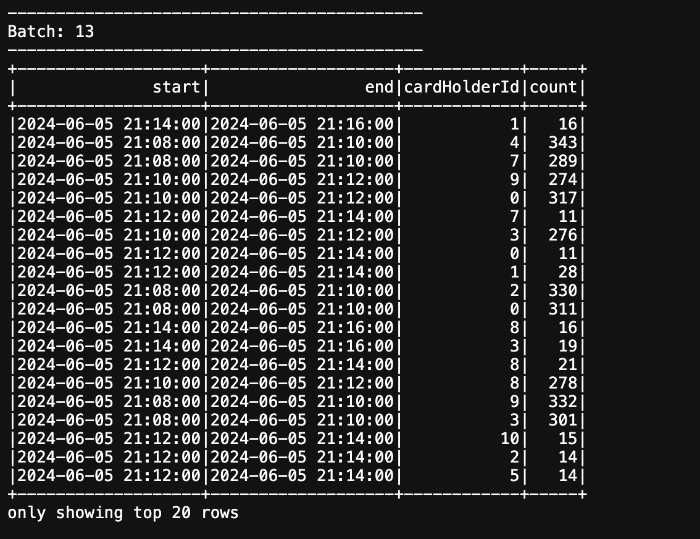

### Run streaming jobs on Amazon EMR Serverless

Starting EMR 7.1.0, we introduced a new job `--mode` on EMR Serverless called **Streaming**. You can submit a streaming job from EMR Studio console or via the `StartJobRun` API. In this example, we will demonstrate how to use EMR Studio to submit a streaming job. You can use the example below for an AWS CLI-based submission, which allows users to specify `--mode` to differentiate **BATCH** from **STREAMING** jobs:

```bash
aws emr-serverless start-job-run \
--application-id <APPPLICATION_ID> \
--execution-role-arn <JOB_EXECUTION_ROLE> \
--mode 'STREAMING' \
--job-driver '{
    "sparkSubmit": {
        "entryPoint": "s3://<streaming script>",
        "entryPointArguments": ["s3://<DOC-EXAMPLE-BUCKET-OUTPUT>/output"],
        "sparkSubmitParameters": "--conf spark.executor.cores=4
            --conf spark.executor.memory=16g 
            --conf spark.driver.cores=4
            --conf spark.driver.memory=16g 
            --conf spark.executor.instances=3"
    }
}'
```

Lets deploy a sample streaming job that reads from Kinesis Data Stream. We will use Kinesis Data Generator to submit records to the stream.


### Pre-requisites:

To implement this solution, ensure you have the following prerequisites:
- An AWS account that provides access to AWS services.
- An IAM role with the required permissions to access the AWS console and deploy the CloudFormation template.

### Deploy the CloudFormation Template

The CloudFormation template has been tested and can be run in **us-west-2**. This CloudFormation template deploys the following resources:

1. **Amazon Kinesis Data Stream**: A Kinesis Data Stream with on-demand stream mode.
2. **Amazon S3 Bucket**: An S3 bucket for storing data.
3. **AWS Identity and Access Management (IAM) Roles and Policies**: Multiple IAM roles and policies required for EMR Serverless, EMR Studio, and other components.
4. **Amazon EMR Serverless Application**: An EMR Serverless application of type Spark.
5. **Amazon Virtual Private Cloud (VPC)**: A VPC with public and private subnets, internet gateway, NAT gateways, route tables, and security groups.
6. **Amazon Cognito User Pool and Identity Pool**: A Cognito user pool and identity pool for authentication and authorization of the Kinesis Data Generator application.
7. **AWS Lambda Functions**: Lambda functions for setting up the Cognito user pool and identity pool.
8. **AWS Secrets Manager Secret**: A Secrets Manager secret to store the Cognito user credentials.
9. **Amazon EMR Studio**: An Amazon EMR Studio with an EMR Studio Workspace Security Group and EMR Engine Security Group.

**Note**: The CloudFormation stack will take approximately **3 minutes** to complete. Remember to follow the steps in the **Cleanup** section to remove the resources after you're finished. This will help avoid incurring costs for the resources created as part of this blog.

### Launch Stack
[`emrs_streaming_blog.yml`](../../../blob/main/cloudformation/kds_emr_serverless.yaml)

### Enter parameters and create the stack

In the **Specify stack details** page:
1. For **Stack name**, enter a name such as `EMRS-Spark-Streaming`.
2. For **EnvironmentName**, leave it as the default value `emrs`.
3. Enter Cognito User details for **KDG**:
   - **Username**: `admin`
   - **Password**: `samplepassword1`

### Send Test Data to Kinesis Data Stream

The **Amazon Kinesis Data Generator** simplifies sending test data to your Kinesis Data Stream. To send test data, follow these steps:

1. Navigate to the **CloudFormation console** and select the `EMRS-Spark-Streaming` stack. In the **Outputs** section, find the `KinesisDataGeneratorUrl`. Click on the URL to access the **Kinesis Data Generator**.
2. Log in to the **Kinesis Data Generator** using the **Cognito user** details you configured when deploying the `EMRS-Spark-Streaming` stack.
3. Once logged in, select **us-west-2** as the Region, choose the **Kinesis Data Stream** created as part of the `EMRS-Spark-Streaming` stack, set a constant rate for the records per second, and copy/paste the following record template in the text area.

```bash
{
    "transactionId": {{random.number(50)}},
    "amount": {{random.number(1000)}},
    "transactionTime": "{{date.now("YYYY-MM-DDTHH:mm:ss")}}",
    "cardHolderId": {{random.number(10)}}
}
```
4. Click on the **Send data** button.


### Submit a Streaming Job to EMR Serverless Application from EMR Studio Console

In this step, we will execute a streaming job, providing the location of [`transactions.py`](./transactions.py) as part of the job arguments. The `transactions.py` file is a Spark Structured Streaming application designed to process data from a Kinesis Data Stream. It identifies high-volume transactions based on a 2-minute sliding window and a threshold of 5 transactions within that window. The application will output the results of this analysis to the console. Upload this script to S3 location.

To submit a streaming job to your EMR Serverless application, follow these steps:

1. Go to **EMR Studio** by and select `my-emr-studio`
2. Select **Application**, or you can [follow this link](link-to-emr-serverless-application) to go directly to the EMR Serverless Application.
3. Click on `my-serverless-application`, then choose **Streaming job runs - new**, and click on **Submit streaming job run**.
4. In the Submit streaming job screen enter the details as below, and Click Submit Job run.

| No  | Key                                                                      | Value                                                                                                           |
|-----|--------------------------------------------------------------------------|-----------------------------------------------------------------------------------------------------------------|
| 1   | Name                                                                     | spark_streaming_job                                                                                              |
| 2   | Runtime role                                                             | emr-serverless-runtime-role                                                                                      |
| 3   | Script location S3 URI (location where transactions.py is stored)        | s3://YourS3BucketName/transactions.py                         |
| 4   | Script arguments                                                         | ["YourKinesisDataStreamName", "s3://YourS3DataBucketName/checkpoint-transactions"]                               |
| 5   | Spark properties                                                         | --jars /usr/share/aws/kinesis/spark-sql-kinesis/lib/spark-streaming-sql-kinesis-connector.jar                    |


5. Make sure the test data is being sent to your Kinesis Data Stream. To view the output of the streaming job, click on **view logs → stdout**
   


7. It will open a new tab where you can see the output as below
   



## Cleanup

1. Terminate/Cancel the Submitted job to your EMR Serverless application.
2. Stop the EMR Serverless application that you created as a part of this blog.
3. Empty the S3 bucket `emrserverless-streaming-<<account-id>>` and `StagingS3Bucket` created as part of the workshop and delete the bucket. [Click here](https://docs.aws.amazon.com/AmazonS3/latest/userguide/delete-bucket.html) to know more about how to delete an Amazon S3 bucket.
4. Open up the [CloudFormation console](https://console.aws.amazon.com/cloudformation) and select the `EMRServerlessBlog` stack, then click on the **Delete** button to terminate the stack.

