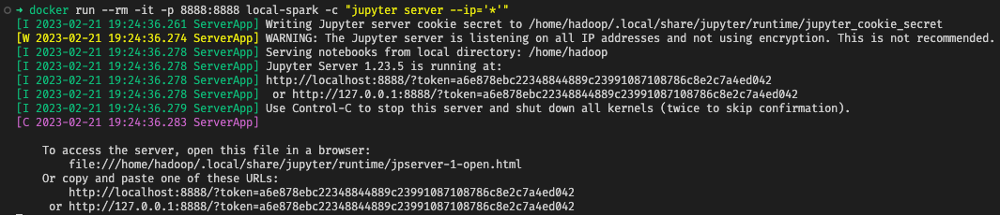

# EMR Serverless Local Development

With the release of [custom images for EMR Serverless](https://docs.aws.amazon.com/emr/latest/EMR-Serverless-UserGuide/application-custom-image.html), the ECR Public Gallery now has images for [Spark](https://gallery.ecr.aws/emr-serverless/spark/emr-6.9.0) and [Hive](https://gallery.ecr.aws/emr-serverless/spark/emr-6.9.0).

While those images can easily be used to [bundle dependencies for your Serverless Spark jobs](https://aws.amazon.com/blogs/big-data/add-your-own-libraries-and-application-dependencies-to-spark-and-hive-on-amazon-emr-serverless-with-custom-images/), they can _also_ be used to create a local container-based development environment.

This example shows how to customize the image for local development including:

- Setting Spark to local mode
- Enabling the Spark UI
- Enabling the Glue Data Catalog by default
- Installing the AWS CLI v2
- Installing Jupyter server and `ipykernel`
- Installing sudo for the hadoop user

## Building image

- Clone this repository and simply do a `docker build`!

```
git clone https://github.com/aws-samples/emr-serverless-samples.git
cd emr-serverless-samples/utilities/local-dev
docker build -t local-emr .
```

## Running Spark

There are several ways to utilize the container. If you just want to start a bash shell, you can simply `docker run`.

```bash
docker run -it local-emr
```

In the shell, you can run typical `pyspark`, `spark-shell`, or `spark-sql` commands.

If you setup AWS Credentials as noted below, you can even run single commands.

```bash
docker run --rm -e AWS_ACCESS_KEY_ID -e AWS_SECRET_ACCESS_KEY -e AWS_SESSION_TOKEN \
    -e AWS_REGION=us-east-1 \
    -it local-emr spark-sql "SHOW TABLES"
```

### AWS Credentials

If you want access to AWS resources like S3 or the Glue Data Catalog, you'll need to provide credentials to your container. There are several ways to do this depending on your environment.

1. Credentials in `~/.aws/config` and/or `~/.aws/credentials` - Mount `~/.aws` to your container.

```bash
docker run -v $HOME/.aws:/home/hadoop/.aws -it local-emr
```

This will mount your [AWS config directory](https://docs.aws.amazon.com/cli/latest/userguide/cli-configure-files.html) in the hadoop user's home directory. You can verify it's working by issuing an `aws s3 ls` command (if your user has access to `s3:ListBuckets`).

2. Use existing environment variables - Pass `-e` to your container.

```bash
docker run --rm -e AWS_ACCESS_KEY_ID -e AWS_SECRET_ACCESS_KEY -e AWS_SESSION_TOKEN -it local-emr
```

_The `AWS_SESSION_TOKEN` variable is optional if you have a temporary token_

## Running Jupyter Notebooks on EMR Local

Since we install jupyter server, we can also run a Docker container that exposes a jupyter server endpoint to our local machine.

```bash
docker run --rm -it -p 8888:8888 local-spark -c "jupyter server --ip='*'"
```

When you run this, you should see output from Jupyter server starting up. You'll be provided a URL you can copy and paste.



If you're using VS Code, you can [connect to a remote Jupyter server](https://code.visualstudio.com/docs/datascience/jupyter-notebooks#_connect-to-a-remote-jupyter-server). Use the `Jupyter: Specify Jupyter server for connections` command and paste in one of the `http` URLs in the server output.

Then when you create a new notebook, you can select the kernel in the top-right corner and use the new connection you just created.

## Use the local environment as a dev container

VS Code has excellent support for [developing inside a container](https://code.visualstudio.com/docs/devcontainers/containers). For an easy way to create a local EMR devcontainer, check out our [Amazon EMR Toolkit](https://marketplace.visualstudio.com/items?itemName=AmazonEMR.emr-tools) extension in the VS Code marketplace.

If you prefer to create the Dev Container yourself, you can use the `Dev Containers: Create Dev Container` command and update your `devcontainer.json` file to point to the Dockerfile in this repo.

PyCharm Professional also supports [configuring an interpreter using Docker](https://www.jetbrains.com/help/pycharm/using-docker-as-a-remote-interpreter.html).
